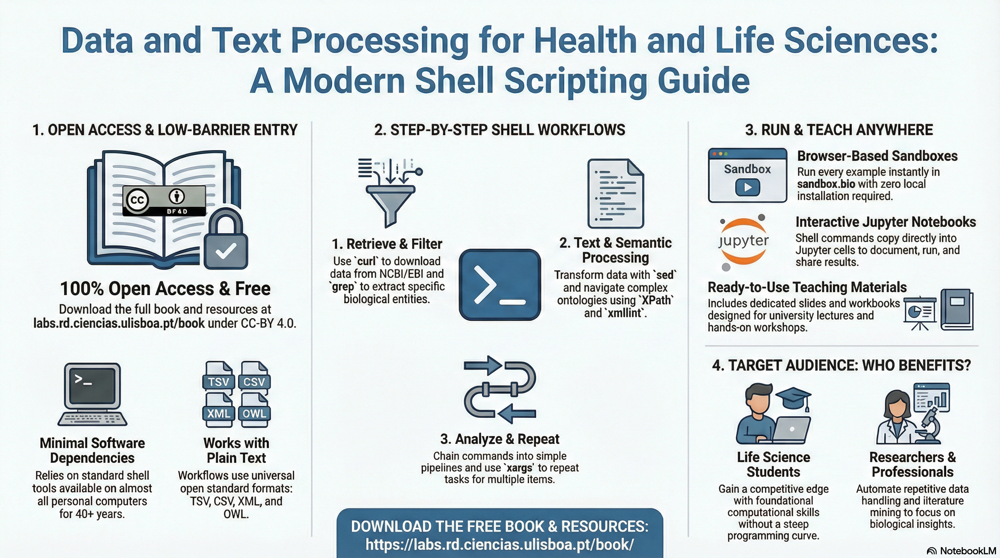

# Data and Text Processing for Health and Life Sciences - Jupyter Notebooks

Interactive Jupyter notebooks accompanying the book **"[Data and Text Processing for Health and Life Sciences](https://labs.rd.ciencias.ulisboa.pt/book/)"**.
Each notebook is a hands-on, step-by-step tutorial demonstrating how Unix shell scripting can be used to find, retrieve, and process biomedical data and text.



> **Note:** Includes a fix for the ChEBI 2.0 web interface, which currently lacks detailed cross-references on individual entry pages.

---

## Contents

| Folder | Description |
|---|---|
| `notebooks/` | Jupyter notebooks (one per tutorial) |
| `data/` | Input and output data files used by the notebooks |
| `scripts/` | Shell scripts created during the tutorials |

---

## Tutorials

| # | Notebook | Open in Colab | Topics Covered |
|---|---|---|---|
| 01 | [unix-shell](notebooks/01-unix-shell.ipynb) | [](https://githubtocolab.com/lasigeBioTM/data-text-processing-notebooks/blob/main/notebooks/01-unix-shell.ipynb) | Unix basics: `ls`, `pwd`, `head`, `cat`, piping. Environment setup for ChEBI retrieval. |
| 02 | [data-retrieval](notebooks/02-data-retrieval.ipynb) | [](https://githubtocolab.com/lasigeBioTM/data-text-processing-notebooks/blob/main/notebooks/02-data-retrieval.ipynb) |`curl` with EBI APIs. Download UniProt cross-references (CSV/XML). Build `getdata.sh`. |
| 03 | [data-extraction](notebooks/03-data-extraction.ipynb) | [](https://githubtocolab.com/lasigeBioTM/data-text-processing-notebooks/blob/main/notebooks/03-data-extraction.ipynb) |`grep` filtering (HUMAN/RAT/MOUSE), `cut` for column selection. Build `getproteins.sh`. |
| 04 | [task-repetition](notebooks/04-task-repetition.ipynb) | [](https://githubtocolab.com/lasigeBioTM/data-text-processing-notebooks/blob/main/notebooks/04-task-repetition.ipynb) | Loops, `xargs`, and `parallel` for batch processing. |
| 05 | [xml-processing](notebooks/05-xml-processing.ipynb) | [](https://githubtocolab.com/lasigeBioTM/data-text-processing-notebooks/blob/main/notebooks/05-xml-processing.ipynb) | `xmllint` with XPath queries on UniProt XML. Extract PubMed IDs. |
| 06 | [text-retrieval](notebooks/06-text-retrieval.ipynb) | [](https://githubtocolab.com/lasigeBioTM/data-text-processing-notebooks/blob/main/notebooks/06-text-retrieval.ipynb) | RDF publication data (UniProt/NCBI). Extract titles and abstracts. |
| 07 | [text-processing](notebooks/07-text-processing.ipynb) | [](https://githubtocolab.com/lasigeBioTM/data-text-processing-notebooks/blob/main/notebooks/07-text-processing.ipynb) | Pattern matching, regular expressions, tokenization, and sentence splitting. |
| 08 | [semantic-processing](notebooks/08-semantic-processing.ipynb) | [](https://githubtocolab.com/lasigeBioTM/data-text-processing-notebooks/blob/main/notebooks/08-semantic-processing.ipynb) | OWL ontologies (ChEBI, DOID), URI/label conversion, synonyms, NER with the MER tool. |

---

## Running the Notebooks

### Option 1 - Google Colab

You can open any notebook manually:
1. Go to [Google Colab](https://colab.research.google.com/)
2. **File -> Open notebook -> GitHub** tab
3. Paste the repository URL: `https://github.com/lasigeBioTM/data-text-processing-notebooks`
4. Select a notebook from the `notebooks/` folder and click **Open**

---

### Option 2 - Local Jupyter

```bash
git clone https://github.com/lasigeBioTM/data-text-processing-notebooks
cd data-text-processing-notebooks
jupyter notebook notebooks/
``` 

## License

This work is licensed under a [Creative Commons Attribution 4.0 International License (CC BY 4.0)](https://creativecommons.org/licenses/by/4.0/).

<a rel="license" href="https://creativecommons.org/licenses/by/4.0/"></a>

